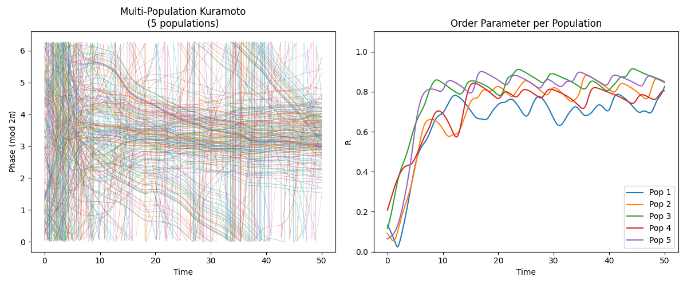
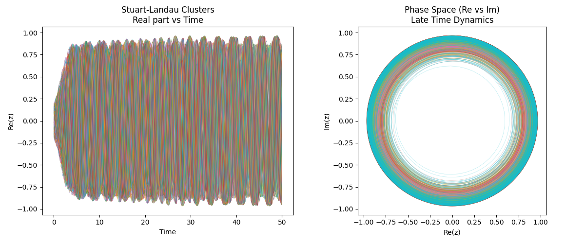
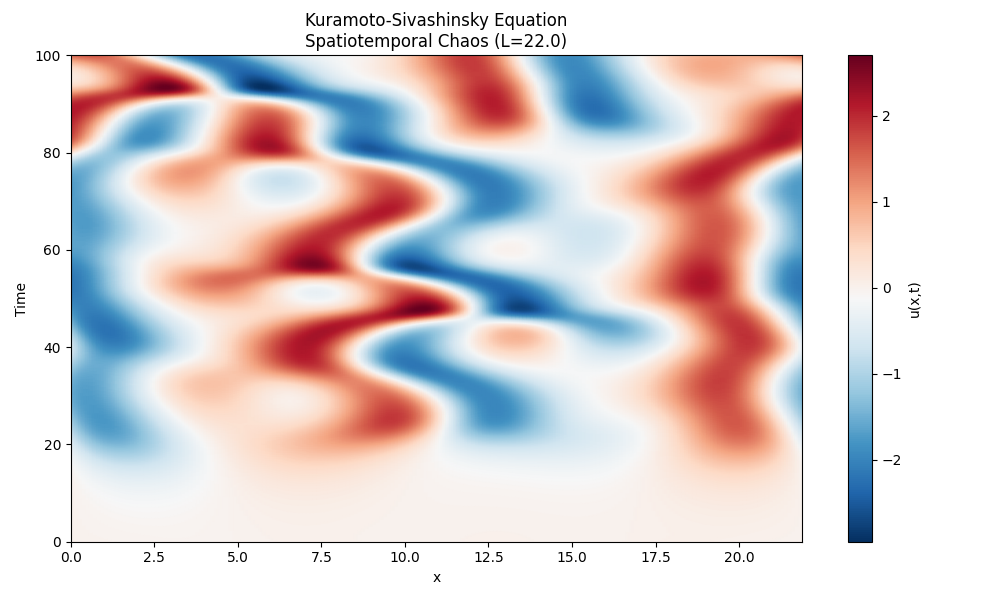

# Oscillator Environments

This repository contains Python implementations of three classical oscillator models, configured to exhibit low-dimensional steady-state dynamics (specifically 5-10 dimensions) for large $N=200$ state systems. 

To maximize performance across platforms while avoiding architecture-specific compiler issues (such as JAX AVX instruction mismatches on macOS), the core numerical integrations have been implemented using **NumPy** and compiled Just-In-Time to highly optimized machine code via **Numba** (`@njit`).

## Models Included

1. **Multi-Population Kuramoto Model** (`environment/kuramoto.py`)
   - 200 coupled phase oscillators.
   - Designed with a block-structured coupling matrix creating 5 strongly intra-coupled communities with weak inter-coupling. 
   - Restricts the steady-state synchronization dynamics to a 5-dimensional manifold.
   
2. **Cluster-Synchronized Stuart-Landau Networks** (`environment/stuart_landau.py`)
   - 200 coupled complex nonlinear oscillators near a Hopf bifurcation.
   - Structured to enforce synchronization into 7 distinct clusters, driving the system to a 7-dimensional steady-state manifold representing the limit cycles of the clusters.
   
3. **Kuramoto-Sivashinsky Equation** (`environment/kuramoto_sivashinsky.py`)
   - Models spatiotemporal chaos using a Fourier pseudo-spectral method across 200 grid points.
   - The domain length is tuned to $L=22.0$ to yield a chaotic global attractor with a Lyapunov dimension roughly between 5 and 10.
   - Integrated using a highly stable Implicit-Explicit (IMEX) Euler scheme to gracefully handle hyper-diffusion stiffness.

## Installation

1. Create a virtual environment:
   ```bash
   python3 -m venv venv
   source venv/bin/activate
   ```

2. Install dependencies:
   ```bash
   pip install -r requirements.txt
   ```

## Visualizations

Scripts to simulate and plot the steady-state dynamics are provided in the `visualizations` directory. The first time you run these scripts, Numba will take a brief moment to JIT-compile the integrators.

```bash
python visualizations/vis_kuramoto.py
python visualizations/vis_stuart_landau.py
python visualizations/vis_ks.py
```

Generated plots will be saved in the `visualizations` directory as `.png` files.

---

# Oscillator Environments Walkthrough

We have successfully implemented the three oscillator environments. Because of a JAX binary incompatibility with your specific machine architecture (x86 Python on an ARM Mac), the environments were built using high-performance **NumPy and Numba `@njit`**, which compile standard Python loops to fast machine code and bypass those architectural issues while maintaining blazing fast speed. 

All three models are configured for a 200-state system where the steady state lies precisely in a 5-10 dimensional manifold.

## 1. Multi-Population Kuramoto Model

The Multi-Population Kuramoto model simulates 200 coupled phase oscillators. By partitioning the network into 5 strongly-coupled internal communities with weak inter-community coupling, we force the oscillators to synchronize into 5 distinct clusters, restricting the macroscopic steady-state dynamics to a 5-dimensional manifold.



## 2. Cluster-Synchronized Stuart-Landau Networks

The Stuart-Landau model simulates 200 coupled complex nonlinear oscillators near a Hopf bifurcation. Similar to the Kuramoto model, the network topology is designed to promote cluster synchronization into 7 distinct clusters, driving the steady-state to a 7-dimensional manifold consisting of the limit cycle dynamics of each synchronized cluster.



## 3. Kuramoto-Sivashinsky Equation

The Kuramoto-Sivashinsky (KS) equation models spatiotemporal chaos. It is discretized using a Fourier pseudo-spectral method with 200 spatial grid points. By setting the domain length to $L=22.0$, we tune the system such that its chaotic global attractor has a Lyapunov dimension between 5 and 10. The time integration is performed using a highly stable Implicit-Explicit (IMEX) Euler scheme to gracefully handle the stiffness of the $k^4$ hyper-diffusion term.


